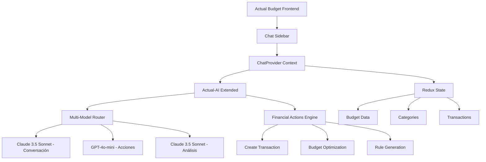

# 🤖 Guía de Integración del Asistente Financiero

## 📋 Índice

1. [Visión General](#-visión-general)
2. [Arquitectura Técnica](#-arquitectura-técnica)
3. [Modelos de IA Recomendados](#-modelos-de-ia-recomendados)
4. [Estructura de Componentes](#-estructura-de-componentes)
5. [Configuración y Variables](#-configuración-y-variables)
6. [Implementación por Fases](#-implementación-por-fases)
7. [Integración con Actual-AI](#-integración-con-actual-ai)
8. [Patrones de Diseño](#-patrones-de-diseño)
9. [UX y Ubicación](#-ux-y-ubicación)
10. [API y Endpoints](#-api-y-endpoints)
11. [Pruebas y Validación](#-pruebas-y-validación)
12. [Despliegue](#-despliegue)

---

## 🎯 Visión General

### **Objetivo Principal**
Integrar un asistente financiero inteligente en Actual Budget que permita:
- **Conversación natural** sobre finanzas personales
- **Acciones directas** (crear transacciones, reglas, reportes)
- **Análisis proactivo** del comportamiento financiero
- **Coaching financiero** personalizado

### **Principios de Diseño**
1. **No invasivo**: Integración fluida sin interrumpir el flujo actual
2. **Contextual**: Comprensión del estado actual de la aplicación
3. **Progresivo**: Implementación en fases incrementales
4. **Modular**: Arquitectura extensible y mantenible
5. **Multi-modelo**: Diferentes IA para diferentes tareas

---

## 🏗️ Arquitectura Técnica

### **Opción Seleccionada: Extensión de Actual-AI + Sidebar Expandible**



### **Stack Tecnológico**
- **Frontend**: React + TypeScript (mantiene consistencia)
- **Estado**: Redux + React Context (patrón actual)
- **IA Backend**: Actual-AI extendido
- **Modelos**: Claude 3.5 Sonnet + GPT-4o-mini
- **Containerización**: Docker Compose
- **Persistencia**: PostgreSQL (actual) + Redis (cache conversaciones)

---

## 🤖 Modelos de IA Recomendados

### **Configuración Multi-Modelo Optimizada**

```bash
# ==========================================
# ASISTENTE FINANCIERO - CONFIGURACIÓN MULTI-MODELO
# (Compatible con .env.ai existente)
# ==========================================

# Usar configuración base existente de .env.ai
# Agregar estas variables específicas para chat:

# Modelo principal para conversación (Claude 3.5 Sonnet)
CHAT_LLM_PROVIDER=anthropic
CHAT_ANTHROPIC_API_KEY=${ANTHROPIC_API_KEY}  # Reutilizar clave existente
CHAT_MODEL=claude-3-5-sonnet-latest
CHAT_TEMPERATURE=0.3
CHAT_MAX_TOKENS=4000

# Modelo para acciones rápidas (GPT-4o-mini)
ACTIONS_LLM_PROVIDER=openai
ACTIONS_OPENAI_API_KEY=${OPENAI_API_KEY}     # Reutilizar clave existente
ACTIONS_MODEL=gpt-4o-mini
ACTIONS_TEMPERATURE=0.1
ACTIONS_MAX_TOKENS=2000

# Modelo para análisis complejos (Claude 3.5 Sonnet)
ANALYSIS_LLM_PROVIDER=anthropic
ANALYSIS_ANTHROPIC_API_KEY=${ANTHROPIC_API_KEY}
ANALYSIS_MODEL=claude-3-5-sonnet-latest
ANALYSIS_TEMPERATURE=0.2
ANALYSIS_MAX_TOKENS=8000

# Fallback económico (OpenRouter - del .env.ai existente)
FALLBACK_LLM_PROVIDER=openrouter
FALLBACK_OPENROUTER_API_KEY=${OPENROUTER_API_KEY}
FALLBACK_MODEL=meta-llama/llama-3.1-8b-instruct:free

# Configuración de chat
CHAT_ENABLED=true
CHAT_HISTORY_LIMIT=50
CHAT_CONTEXT_WINDOW=conversation,budget,transactions
CHAT_SESSION_TIMEOUT=3600
```

### **Criterios de Selección de Modelos**

| Tarea | Modelo | Justificación |
|-------|--------|---------------|
| **Conversación General** | Claude 3.5 Sonnet | Mejor comprensión contextual, excelente en español, respuestas estructuradas |
| **Acciones Directas** | GPT-4o-mini | Rápido, económico, excelente function calling, determinista |
| **Análisis Complejos** | Claude 3.5 Sonnet | Superior en análisis de datos, reasoning matemático, reportes largos |
| **Fallback/Testing** | Llama 3.1 8B (OpenRouter) | Gratuito, buena calidad, ideal para desarrollo |

---

## 🧩 Estructura de Componentes

### **Arquitectura de Frontend**

```
packages/desktop-client/src/
├── components/
│   ├── chat/
│   │   ├── ChatInterface.tsx              # Componente principal
│   │   ├── ChatProvider.tsx               # Context provider
│   │   ├── ChatSidebar.tsx                # Sidebar expandible
│   │   ├── ChatModal.tsx                  # Modal fullscreen
│   │   ├── MessageHistory.tsx             # Historial de mensajes
│   │   ├── QuickActions.tsx               # Acciones rápidas
│   │   ├── FinancialActionsPanel.tsx      # Panel de acciones
│   │   ├── BudgetCoach.tsx                # Coach financiero
│   │   ├── SmartSuggestions.tsx           # Sugerencias inteligentes
│   │   └── components/
│   │       ├── ChatMessage.tsx            # Componente mensaje
│   │       ├── ChatInput.tsx              # Input de chat
│   │       ├── TypingIndicator.tsx        # Indicador escribiendo
│   │       ├── ActionButton.tsx           # Botones de acción
│   │       └── ContextualHelp.tsx         # Ayuda contextual
│   └── modals/
│       └── FinancialChatModal.tsx         # Modal específico
├── hooks/
│   ├── useFinancialChat.ts            # Hook principal del chat
│   ├── useChatHistory.ts              # Persistencia conversaciones
│   ├── useAIActions.ts                # Integración actual-ai
│   ├── useChatContext.ts              # Contexto financiero
│   ├── useSmartSuggestions.ts         # Sugerencias IA
│   └── useChatSidebar.ts              # Estado sidebar
└── redux/
    └── slices/
        └── chatSlice.ts               # Estado Redux del chat
```

### **Componentes Principales**

#### **1. ChatProvider.tsx**
```typescript
export interface FinancialChatContextValue {
  // Estado del chat
  messages: ChatMessage[];
  isLoading: boolean;
  isTyping: boolean;
  currentConversationId: string | null;
  
  // Acciones del chat
  sendMessage: (message: string) => Promise<void>;
  executeAction: (action: FinancialAction) => Promise<void>;
  clearChat: () => void;
  loadConversation: (id: string) => Promise<void>;
  
  // Contexto financiero
  currentContext: FinancialContext;
  availableActions: FinancialAction[];
  suggestions: SmartSuggestion[];
  
  // Configuración
  sidebarState: 'collapsed' | 'mini' | 'expanded';
  setSidebarState: (state: SidebarState) => void;
}
```

#### **2. ChatSidebar.tsx**
```typescript
type SidebarState = 'collapsed' | 'mini' | 'expanded';

interface ChatSidebarProps {
  context: FinancialContext;
  defaultState?: SidebarState;
}

// Tres estados del sidebar:
// - Collapsed (40px): Solo ícono de chat
// - Mini (300px): Chat básico con quick actions
// - Expanded (500px): Chat completo con historial
```

#### **3. FinancialActionsPanel.tsx**
```typescript
interface FinancialAction {
  id: string;
  type: 'create_transaction' | 'update_budget' | 'create_rule' | 'generate_report';
  title: string;
  description: string;
  icon: ReactNode;
  handler: (params: unknown) => Promise<void>;
  context?: string[];  // En qué vistas aparece
}
```

---

## ⚙️ Configuración y Variables

### **Variables de Entorno Extendidas**

```bash
# ==========================================
# ASISTENTE FINANCIERO - CONFIGURACIÓN COMPLETA
# (Extensión de .env.ai existente)
# ==========================================

# Configuración base (heredada del .env.ai existente)
ACTUAL_PASSWORD=your_password_here
ACTUAL_BUDGET_ID=your_budget_id_here

# ==========================================
# MULTI-MODELO CONFIGURATION (NUEVO)
# ==========================================

# Reutilizar configuración existente del .env.ai
# Solo agregar configuración específica para el chat:

# Funcionalidades habilitadas (extender FEATURES existente)
FEATURES=classification,chat,financial_actions,budget_coach,smart_suggestions

# Configuración de chat
CHAT_ENABLED=true
CHAT_HISTORY_LIMIT=50
CHAT_SESSION_TIMEOUT=3600
CHAT_AUTO_SUGGESTIONS=true
CHAT_CONTEXT_WINDOW=conversation,budget,transactions,categories

# Configuración de persistencia
CHAT_STORAGE_TYPE=memory  # Inicialmente memory, luego postgresql
CHAT_ENCRYPTION_ENABLED=false  # Inicialmente false para simplicidad
CHAT_RETENTION_DAYS=90

# ==========================================
# FINANCIAL ACTIONS
# ==========================================

# Acciones habilitadas
ACTIONS_CREATE_TRANSACTION=true
ACTIONS_UPDATE_BUDGET=true
ACTIONS_CREATE_RULES=true
ACTIONS_GENERATE_REPORTS=true
ACTIONS_SUGGEST_OPTIMIZATIONS=true

# Límites de seguridad
ACTIONS_MAX_TRANSACTION_AMOUNT=10000
ACTIONS_REQUIRE_CONFIRMATION=true
ACTIONS_AUDIT_LOG=true

# ==========================================
# SMART SUGGESTIONS
# ==========================================

SUGGESTIONS_ENABLED=true
SUGGESTIONS_PROACTIVE=true
SUGGESTIONS_FREQUENCY=daily  # daily, weekly, monthly
SUGGESTIONS_CATEGORIES=budget,spending,saving,optimization

# ==========================================
# PERFORMANCE & CACHING
# ==========================================

# Cache de respuestas
AI_RESPONSE_CACHE_TTL=300
AI_CONTEXT_CACHE_TTL=60

# Rate limiting
CHAT_RATE_LIMIT_PER_MINUTE=30
ACTIONS_RATE_LIMIT_PER_HOUR=100

# ==========================================
# DEVELOPMENT & DEBUGGING
# ==========================================

# Logging
CHAT_LOG_LEVEL=info  # debug, info, warn, error
CHAT_LOG_CONVERSATIONS=false  # Solo para desarrollo

# Testing
CHAT_MOCK_MODE=false
CHAT_TEST_USER_ID=test_user

# Métricas
CHAT_METRICS_ENABLED=true
CHAT_ANALYTICS_ENDPOINT=http://localhost:3002/analytics
```

---

## 📅 Implementación por Fases

### **Fase 1: Foundation (2-3 días)**

#### **Objetivos**
- Setup básico del chat
- Integración con actual-ai
- UI minimalista funcional

#### **Tareas**
1. **Extender actual-ai con endpoint `/chat`**
   ```bash
   # Usar configuración existente de docker-compose.ai.yml
   # Agregar nuevas variables al .env.ai existente:
   FEATURES=classification,chat,financial_actions
   CHAT_ENABLED=true
   
   # Nuevos endpoints en actual-ai existente
   POST /api/chat/message
   GET /api/chat/history
   POST /api/chat/action
   DELETE /api/chat/clear
   ```

2. **Crear componentes base**
   ```typescript
   // Estructura mínima compatible con tu fork
   packages/desktop-client/src/components/chat/
   ├── ChatProvider.tsx (context básico)
   ├── ChatModal.tsx (modal simple)
   ├── ChatMessage.tsx (componente mensaje)
   └── ChatInput.tsx (input básico)
   
   // Usar hooks existentes del proyecto
   import { useSelector, useDispatch } from '@desktop-client/redux';
   import { useModalState } from '@desktop-client/hooks/useModalState';
   ```

#### **3. Integrar con sistema de modales existente**
   ```typescript
   // Agregar a Modals.tsx existente
   import { FinancialChatModal } from './modals/FinancialChatModal';
   
   // En el switch statement de Modals.tsx:
   case 'financial-chat':
     return <FinancialChatModal key={key} {...modal.options} />;
   ```

#### **Entregables**
- ✅ Chat básico funcional
- ✅ Conexión con actual-ai
- ✅ Modal de chat integrado
- ✅ Primer mensaje de prueba

### **Fase 2: Contexto (3-4 días)**

#### **Objetivos**
- Integración completa con estado de Actual Budget
- Acciones básicas funcionales
- Persistencia de conversaciones

#### **Tareas**
1. **Contexto financiero completo**
   ```typescript
   interface FinancialContext {
     currentView: 'budget' | 'accounts' | 'reports';
     selectedMonth: string;
     selectedCategory?: string;
     selectedAccount?: string;
     budgetSummary: BudgetSummary;
     recentTransactions: TransactionEntity[];
     categories: CategoryEntity[];
     userPreferences: UserPreferences;
   }
   ```

2. **Acciones básicas**
   ```typescript
   // Implementar acciones
   - createTransaction()
   - explainCategory()
   - showBudgetSummary()
   - suggestCategory()
   ```

3. **Integración con Redux state**
   ```typescript
   // Usar hooks existentes del proyecto
   import { useSelector, useDispatch } from '@desktop-client/redux';
   import { useCategories } from '@desktop-client/hooks/useCategories';
   import { useAccounts } from '@desktop-client/hooks/useAccounts';
   
   interface FinancialContext {
     currentView: 'budget' | 'accounts' | 'reports';
     selectedMonth: string;
     selectedCategory?: string;
     selectedAccount?: string;
     budgetSummary: BudgetSummary;
     recentTransactions: TransactionEntity[];
     categories: CategoryEntity[];
     userPreferences: UserPreferences;
   }
   ```

#### **Entregables**
- ✅ Contexto completo implementado
- ✅ 5 acciones básicas funcionales
- ✅ Persistencia de conversaciones
- ✅ Integración con Redux state

### **Fase 3: Inteligencia (4-5 días)**

#### **Objetivos**
- Acciones complejas
- Análisis proactivo
- Multi-modelo routing

#### **Tareas**
1. **Router multi-modelo**
   ```typescript
   class AIModelRouter {
     route(intent: string, complexity: 'simple' | 'complex'): AIProvider {
       if (intent === 'action' && complexity === 'simple') return gpt4oMini;
       if (intent === 'analysis') return claude35Sonnet;
       if (intent === 'conversation') return claude35Sonnet;
       return defaultModel;
     }
   }
   ```

2. **Acciones avanzadas**
   ```typescript
   // Implementar acciones complejas
   - generateBudgetOptimization()
   - createSmartRules()
   - analyzeSpendingPatterns()
   - forecastBudget()
   ```

3. **Sistema de sugerencias**
   ```typescript
   interface SmartSuggestion {
     id: string;
     type: 'optimization' | 'warning' | 'opportunity';
     title: string;
     description: string;
     confidence: number;
     action?: FinancialAction;
   }
   ```

#### **Entregables**
- ✅ Router multi-modelo funcional
- ✅ 10 acciones avanzadas
- ✅ Sistema de sugerencias
- ✅ Análisis proactivo

### **Fase 4: UX Avanzado (3-4 días)**

#### **Objetivos**
- Sidebar expandible
- Quick actions
- Notificaciones inteligentes
- UX pulida

#### **Tareas**
1. **Sidebar expandible**
   ```typescript
   // Tres estados con animaciones
   - Collapsed (40px): Solo ícono
   - Mini (300px): Chat rápido
   - Expanded (500px): Chat completo
   ```

2. **Quick actions contextuales**
   ```typescript
   // Acciones rápidas por vista
   Budget View: ["Optimize this category", "Explain overspending", "Set budget goal"]
   Accounts View: ["Categorize transactions", "Create rule", "Analyze account"]
   Reports View: ["Explain trend", "Generate insights", "Export analysis"]
   ```

3. **Notificaciones inteligentes**
   ```typescript
   // Sistema de notificaciones
   - Budget alerts
   - Spending anomalies
   - Optimization opportunities
   - Goal achievements
   ```

#### **Entregables**
- ✅ Sidebar expandible completo
- ✅ Quick actions por vista
- ✅ Sistema de notificaciones
- ✅ UX pulida y responsive

---

## 🔌 Integración con Actual-AI

### **Extensión de Docker Compose**

```yaml
# docker-compose.chat.yml - Extensión para chat financiero
version: '3.8'

services:
  # Extender servicio actual-ai existente
  actual-ai:
    # Usar configuración existente de docker-compose.ai.yml
    extends:
      file: docker-compose.ai.yml
      service: actual-ai
    environment:
      # Configuración existente +
      - FEATURES=classification,chat,financial_actions
      - CHAT_ENABLED=true
      - MULTI_MODEL_ENABLED=true
      
      # Multi-modelo específico para chat
      - CHAT_LLM_PROVIDER=${CHAT_LLM_PROVIDER:-anthropic}
      - ACTIONS_LLM_PROVIDER=${ACTIONS_LLM_PROVIDER:-openai}
      - ANALYSIS_LLM_PROVIDER=${ANALYSIS_LLM_PROVIDER:-anthropic}
      
      # Configuración de chat
      - CHAT_HISTORY_LIMIT=50
      - CHAT_CONTEXT_WINDOW=conversation,budget,transactions
      - CHAT_SESSION_TIMEOUT=3600
    ports:
      - "3002:3000"  # Puerto específico para funciones de chat
    volumes:
      - ./logs/actual-ai-chat:/app/logs
    networks:
      - actual-network

  # Cache Redis para conversaciones (opcional)
  actual-redis:
    image: redis:7-alpine
    container_name: actual-redis
    ports:
      - "6379:6379"
    volumes:
      - actual-redis-data:/data
    networks:
      - actual-network
    command: redis-server --appendonly yes

volumes:
  actual-redis-data:

networks:
  actual-network:
    external: true
```

### **Nuevos Endpoints API**

```typescript
// API endpoints para el asistente financiero

// Chat endpoints
POST   /api/chat/message              // Enviar mensaje
GET    /api/chat/history/:id          // Obtener historial
POST   /api/chat/conversation         // Nueva conversación
DELETE /api/chat/conversation/:id     // Eliminar conversación
PUT    /api/chat/conversation/:id     // Actualizar conversación

// Actions endpoints
POST   /api/actions/execute           // Ejecutar acción
GET    /api/actions/available         // Acciones disponibles
POST   /api/actions/validate          // Validar acción

// Suggestions endpoints
GET    /api/suggestions               // Obtener sugerencias
POST   /api/suggestions/dismiss       // Descartar sugerencia
GET    /api/suggestions/history       // Historial sugerencias

// Context endpoints
GET    /api/context/current           // Contexto actual
POST   /api/context/update            // Actualizar contexto

// Analytics endpoints
POST   /api/analytics/event           // Registrar evento
GET    /api/analytics/metrics         // Métricas de uso
```

### **Estructura de Requests/Responses**

```typescript
// Chat Message Request
interface ChatMessageRequest {
  message: string;
  conversationId?: string;
  context: FinancialContext;
  includeActions?: boolean;
}

// Chat Message Response
interface ChatMessageResponse {
  id: string;
  content: string;
  conversationId: string;
  actions?: FinancialAction[];
  suggestions?: SmartSuggestion[];
  metadata: {
    model: string;
    tokens: number;
    confidence: number;
    processingTime: number;
  };
}

// Financial Action Request
interface ActionExecuteRequest {
  actionType: string;
  parameters: Record<string, unknown>;
  context: FinancialContext;
  confirmationRequired?: boolean;
}

// Financial Action Response
interface ActionExecuteResponse {
  success: boolean;
  result?: unknown;
  error?: string;
  needsConfirmation?: boolean;
  confirmationMessage?: string;
}
```

---

## 🎨 Patrones de Diseño

### **1. Context Pattern (React Context)**

```typescript
// Patrón principal para estado del chat
export const FinancialChatProvider: React.FC<PropsWithChildren> = ({ children }) => {
  const [state, dispatch] = useReducer(chatReducer, initialState);
  const { categories } = useCategories();
  const { accounts } = useAccounts();
  const budget = useBudget();
  
  const contextValue = useMemo(() => ({
    ...state,
    sendMessage: (message: string) => sendMessageAction(dispatch, message),
    executeAction: (action: FinancialAction) => executeActionHandler(dispatch, action),
    // ... otros métodos
  }), [state, categories, accounts, budget]);
  
  return (
    <FinancialChatContext.Provider value={contextValue}>
      {children}
    </FinancialChatContext.Provider>
  );
};
```

### **2. Hook Pattern (Custom Hooks)**

```typescript
// Hook principal para el chat
export function useFinancialChat() {
  const context = useContext(FinancialChatContext);
  if (!context) {
    throw new Error('useFinancialChat must be used within FinancialChatProvider');
  }
  return context;
}

// Hook para acciones específicas
export function useAIActions() {
  const { executeAction } = useFinancialChat();
  const dispatch = useDispatch();
  
  return {
    createTransaction: (data: TransactionData) => 
      executeAction({ type: 'create_transaction', data }),
    updateBudget: (categoryId: string, amount: number) => 
      executeAction({ type: 'update_budget', categoryId, amount }),
    // ... otras acciones
  };
}
```

### **3. Command Pattern (Financial Actions)**

```typescript
// Patrón Command para acciones financieras
abstract class FinancialCommand {
  abstract execute(context: FinancialContext): Promise<ActionResult>;
  abstract validate(parameters: unknown): boolean;
  abstract describe(): string;
}

class CreateTransactionCommand extends FinancialCommand {
  constructor(private params: TransactionParams) {
    super();
  }
  
  async execute(context: FinancialContext): Promise<ActionResult> {
    // Implementación específica
  }
  
  validate(parameters: TransactionParams): boolean {
    // Validación específica
  }
  
  describe(): string {
    return `Create transaction: ${this.params.description}`;
  }
}

// Factory para crear comandos
class FinancialCommandFactory {
  static create(type: string, params: unknown): FinancialCommand {
    switch (type) {
      case 'create_transaction':
        return new CreateTransactionCommand(params as TransactionParams);
      case 'update_budget':
        return new UpdateBudgetCommand(params as BudgetParams);
      // ... otros comandos
    }
  }
}
```

### **4. Strategy Pattern (AI Model Selection)**

```typescript
// Estrategia para selección de modelo IA
interface AIStrategy {
  name: string;
  canHandle(intent: string, complexity: string): boolean;
  process(message: string, context: FinancialContext): Promise<AIResponse>;
}

class ConversationStrategy implements AIStrategy {
  name = 'claude-3-5-sonnet';
  
  canHandle(intent: string): boolean {
    return intent === 'conversation' || intent === 'explanation';
  }
  
  async process(message: string, context: FinancialContext): Promise<AIResponse> {
    // Implementación con Claude
  }
}

class ActionStrategy implements AIStrategy {
  name = 'gpt-4o-mini';
  
  canHandle(intent: string): boolean {
    return intent === 'action' || intent === 'command';
  }
  
  async process(message: string, context: FinancialContext): Promise<AIResponse> {
    // Implementación con GPT-4o-mini
  }
}

// Context para estrategias
class AIModelContext {
  private strategies: AIStrategy[] = [
    new ConversationStrategy(),
    new ActionStrategy(),
    new AnalysisStrategy()
  ];
  
  selectStrategy(intent: string, complexity: string): AIStrategy {
    return this.strategies.find(s => s.canHandle(intent, complexity)) 
           || this.strategies[0]; // fallback
  }
}
```

---

## 📱 UX y Ubicación

### **Diseño de Sidebar Expandible**

```typescript
// Estados del sidebar
type SidebarState = 'collapsed' | 'mini' | 'expanded';

const SIDEBAR_WIDTHS = {
  collapsed: 40,
  mini: 300,
  expanded: 500
} as const;

// Componente principal
const ChatSidebar: React.FC<ChatSidebarProps> = ({ context, defaultState = 'collapsed' }) => {
  const [state, setState] = useState<SidebarState>(defaultState);
  const { messages, isLoading, sendMessage } = useFinancialChat();
  
  const toggleState = () => {
    const nextState = {
      collapsed: 'mini',
      mini: 'expanded',
      expanded: 'collapsed'
    }[state] as SidebarState;
    
    setState(nextState);
  };
  
  return (
    <AnimatedSidebar
      width={SIDEBAR_WIDTHS[state]}
      state={state}
      onToggle={toggleState}
    >
      {state === 'collapsed' && <CollapsedView />}
      {state === 'mini' && <MiniChatView />}
      {state === 'expanded' && <FullChatView />}
    </AnimatedSidebar>
  );
};
```

### **Vistas por Estado**

#### **1. Collapsed View (40px)**
```typescript
const CollapsedView = () => (
  <div className="flex flex-col items-center p-2 h-full">
    <ChatIcon className="w-6 h-6 text-blue-500" />
    <NotificationBadge count={unreadCount} />
  </div>
);
```

#### **2. Mini Chat View (300px)**
```typescript
const MiniChatView = () => (
  <div className="flex flex-col h-full">
    <MiniChatHeader />
    <QuickActions context={context} />
    <RecentMessage />
    <ChatInput placeholder="Ask something quick..." />
  </div>
);
```

#### **3. Full Chat View (500px)**
```typescript
const FullChatView = () => (
  <div className="flex flex-col h-full">
    <ChatHeader withHistory withSettings />
    <ConversationList />
    <MessageHistory messages={messages} />
    <TypingIndicator visible={isLoading} />
    <ActionSuggestions suggestions={suggestions} />
    <FullChatInput />
  </div>
);
```

### **Quick Actions Contextuales**

```typescript
// Quick actions por vista de la aplicación
const CONTEXTUAL_ACTIONS: Record<string, QuickAction[]> = {
  budget: [
    { id: 'optimize_category', label: 'Optimize this category', icon: TrendingUpIcon },
    { id: 'explain_overspending', label: 'Why am I overspending?', icon: AlertIcon },
    { id: 'set_budget_goal', label: 'Set budget goal', icon: TargetIcon },
    { id: 'compare_last_month', label: 'Compare to last month', icon: CompareIcon }
  ],
  accounts: [
    { id: 'categorize_transactions', label: 'Categorize recent', icon: TagIcon },
    { id: 'create_rule', label: 'Create rule', icon: RuleIcon },
    { id: 'analyze_spending', label: 'Analyze spending', icon: AnalyticsIcon },
    { id: 'find_duplicates', label: 'Find duplicates', icon: DuplicateIcon }
  ],
  reports: [
    { id: 'explain_trend', label: 'Explain this trend', icon: TrendIcon },
    { id: 'generate_insights', label: 'Generate insights', icon: BulbIcon },
    { id: 'export_analysis', label: 'Export analysis', icon: DownloadIcon },
    { id: 'forecast_budget', label: 'Forecast next month', icon: CrystalBallIcon }
  ]
};
```

### **Comportamiento Responsive**

```typescript
// Comportamiento responsive
const useResponsiveChatSidebar = () => {
  const { isNarrowWidth } = useResponsive();
  const [state, setState] = useState<SidebarState>('collapsed');
  
  useEffect(() => {
    if (isNarrowWidth && state === 'expanded') {
      // En móvil, cambiar a modal fullscreen
      setState('collapsed');
      // Abrir modal de chat
      dispatch(pushModal({ modal: { name: 'financial-chat-mobile' } }));
    }
  }, [isNarrowWidth, state]);
  
  return { state, setState };
};
```

---

## 🔗 API y Endpoints

### **Configuración de Endpoints**

```typescript
// Configuración base de la API - usar actual-ai existente
const AI_CHAT_BASE_URL = process.env.NODE_ENV === 'development' 
  ? 'http://localhost:3000/api'  // Puerto de actual-ai existente
  : '/api/ai-chat';

// Cliente API reutilizando infraestructura actual-ai
class FinancialChatAPI {
  private baseURL: string;
  private headers: Record<string, string>;
  
  constructor(baseURL: string) {
    this.baseURL = baseURL;
    this.headers = {
      'Content-Type': 'application/json',
      // Sin auth token inicial - usar configuración actual-ai
    };
  }
  
  async sendMessage(request: ChatMessageRequest): Promise<ChatMessageResponse> {
    const response = await fetch(`${this.baseURL}/chat/message`, {
      method: 'POST',
      headers: this.headers,
      body: JSON.stringify(request)
    });
    
    if (!response.ok) {
      throw new Error(`Chat API error: ${response.statusText}`);
    }
    
    return response.json();
  }
  
  async executeAction(request: ActionExecuteRequest): Promise<ActionExecuteResponse> {
    const response = await fetch(`${this.baseURL}/actions/execute`, {
      method: 'POST',
      headers: this.headers,
      body: JSON.stringify(request)
    });
    
    return response.json();
  }
  
  async getConversationHistory(id: string): Promise<ChatMessage[]> {
    const response = await fetch(`${this.baseURL}/chat/history/${id}`, {
      headers: this.headers
    });
    
    return response.json();
  }
}
```

### **Error Handling**

```typescript
// Manejo de errores específico
class ChatErrorHandler {
  static handle(error: unknown): ChatError {
    if (error instanceof Error) {
      if (error.message.includes('rate limit')) {
        return new ChatError('RATE_LIMIT', 'Too many requests. Please wait a moment.');
      }
      
      if (error.message.includes('unauthorized')) {
        return new ChatError('UNAUTHORIZED', 'Please check your API configuration.');
      }
      
      if (error.message.includes('model')) {
        return new ChatError('MODEL_ERROR', 'AI model temporarily unavailable.');
      }
    }
    
    return new ChatError('UNKNOWN', 'An unexpected error occurred.');
  }
}

class ChatError extends Error {
  constructor(
    public code: string,
    public userMessage: string,
    public originalError?: unknown
  ) {
    super(userMessage);
    this.name = 'ChatError';
  }
}
```

### **Retry Logic**

```typescript
// Lógica de reintentos
class RetryableAPI {
  private maxRetries = 3;
  private baseDelay = 1000;
  
  async withRetry<T>(
    operation: () => Promise<T>,
    retries = this.maxRetries
  ): Promise<T> {
    try {
      return await operation();
    } catch (error) {
      if (retries > 0 && this.isRetryable(error)) {
        await this.delay(this.baseDelay * (this.maxRetries - retries + 1));
        return this.withRetry(operation, retries - 1);
      }
      throw error;
    }
  }
  
  private isRetryable(error: unknown): boolean {
    return error instanceof Error && (
      error.message.includes('timeout') ||
      error.message.includes('network') ||
      error.message.includes('503') ||
      error.message.includes('502')
    );
  }
  
  private delay(ms: number): Promise<void> {
    return new Promise(resolve => setTimeout(resolve, ms));
  }
}
```

---

## 🧪 Pruebas y Validación

### **Estrategia de Testing**

```typescript
// Tests unitarios para componentes
describe('FinancialChatProvider', () => {
  test('should provide chat context', () => {
    render(
      <FinancialChatProvider>
        <TestComponent />
      </FinancialChatProvider>
    );
    
    expect(screen.getByText('Chat loaded')).toBeInTheDocument();
  });
  
  test('should handle message sending', async () => {
    const mockSendMessage = jest.fn();
    render(<ChatInput onSend={mockSendMessage} />);
    
    fireEvent.change(screen.getByRole('textbox'), { 
      target: { value: 'Test message' } 
    });
    fireEvent.click(screen.getByText('Send'));
    
    expect(mockSendMessage).toHaveBeenCalledWith('Test message');
  });
});

// Tests de integración
describe('Chat Integration', () => {
  test('should integrate with actual-ai API', async () => {
    const mockAPI = new MockFinancialChatAPI();
    mockAPI.setResponse({ content: 'Test response' });
    
    const { result } = renderHook(() => useFinancialChat(), {
      wrapper: ({ children }) => (
        <FinancialChatProvider api={mockAPI}>
          {children}
        </FinancialChatProvider>
      )
    });
    
    await act(async () => {
      await result.current.sendMessage('Test message');
    });
    
    expect(result.current.messages).toHaveLength(2);
    expect(result.current.messages[1].content).toBe('Test response');
  });
});
```

### **Tests E2E**

```typescript
// Playwright tests
test('Financial Chat E2E Flow', async ({ page }) => {
  await page.goto('/budget');
  
  // Abrir chat
  await page.click('[data-testid="chat-sidebar-toggle"]');
  
  // Enviar mensaje
  await page.fill('[data-testid="chat-input"]', 'How much did I spend on groceries this month?');
  await page.click('[data-testid="chat-send"]');
  
  // Verificar respuesta
  await expect(page.locator('[data-testid="chat-message"]').last()).toContainText('groceries');
  
  // Ejecutar acción sugerida
  await page.click('[data-testid="action-button"]');
  
  // Verificar que la acción se ejecutó
  await expect(page.locator('[data-testid="notification"]')).toContainText('Transaction created');
});
```

### **Performance Testing**

```typescript
// Tests de performance
describe('Chat Performance', () => {
  test('should render messages efficiently', () => {
    const manyMessages = Array.from({ length: 1000 }, (_, i) => ({
      id: `msg-${i}`,
      content: `Message ${i}`,
      role: 'user' as const,
      timestamp: new Date()
    }));
    
    const { rerender } = render(
      <MessageHistory messages={manyMessages.slice(0, 100)} />
    );
    
    const startTime = performance.now();
    rerender(<MessageHistory messages={manyMessages} />);
    const endTime = performance.now();
    
    expect(endTime - startTime).toBeLessThan(100); // < 100ms
  });
});
```

---

## 🚀 Despliegue

### **Docker Configuration**

```dockerfile
# Dockerfile.ai-chat - Dockerfile específico para chat
FROM node:18-alpine

WORKDIR /app

# Instalar dependencias
COPY package*.json ./
RUN npm ci --only=production

# Copiar código
COPY . .

# Variables de entorno por defecto
ENV NODE_ENV=production
ENV PORT=3000
ENV CHAT_ENABLED=true

# Exponer puerto
EXPOSE 3000

# Health check
HEALTHCHECK --interval=30s --timeout=3s --start-period=5s --retries=3 \
  CMD curl -f http://localhost:3000/health || exit 1

# Comando de inicio
CMD ["npm", "start"]
```

### **Deployment Script**

```bash
#!/bin/bash
# deploy-chat.sh - Script de despliegue usando infraestructura actual-ai existente

set -e

echo "🚀 Deploying Financial Assistant Chat..."

# Variables
ENV_FILE=".env.ai"  # Usar archivo existente

# Verificar archivos necesarios
if [ ! -f "$ENV_FILE" ]; then
  echo "❌ Error: $ENV_FILE not found. Copy from .env.ai.example"
  exit 1
fi

# Verificar que actual-ai esté configurado
if ! grep -q "CHAT_ENABLED=true" "$ENV_FILE"; then
  echo "⚠️  Adding CHAT_ENABLED=true to $ENV_FILE"
  echo "CHAT_ENABLED=true" >> "$ENV_FILE"
fi

if ! grep -q "FEATURES.*chat" "$ENV_FILE"; then
  echo "⚠️  Adding chat to FEATURES in $ENV_FILE"
  # Actualizar FEATURES existente o crear nueva línea
  if grep -q "^FEATURES=" "$ENV_FILE"; then
    sed -i '' 's/FEATURES=\(.*\)/FEATURES=\1,chat,financial_actions/' "$ENV_FILE"
  else
    echo "FEATURES=classification,chat,financial_actions" >> "$ENV_FILE"
  fi
fi

# Restart actual-ai service con nueva configuración
echo "🔄 Restarting actual-ai with chat features..."
docker-compose -f docker-compose.ai.yml down
docker-compose -f docker-compose.ai.yml up -d

# Verificar salud
echo "🔍 Checking service health..."
sleep 15

if docker ps --filter "name=actual-ai" --filter "status=running" | grep -q actual-ai; then
  echo "✅ Financial Assistant Chat deployed successfully!"
  echo "📊 Service status:"
  docker ps --filter "name=actual-ai"
  echo "🌐 Chat API available at: http://localhost:3000/api/chat"
else
  echo "❌ Deployment failed!"
  echo "📋 Service logs:"
  docker-compose -f docker-compose.ai.yml logs actual-ai
  exit 1
fi
```

### **Monitoring y Logs**

```yaml
# docker-compose.monitoring.yml
version: '3.8'

services:
  # Logs aggregation
  fluentd:
    image: fluentd:v1.16
    container_name: actual-fluentd
    volumes:
      - ./logs:/fluentd/log
      - ./fluentd.conf:/fluentd/etc/fluent.conf
    ports:
      - "24224:24224"
    networks:
      - actual-network

  # Metrics collection
  prometheus:
    image: prom/prometheus
    container_name: actual-prometheus
    volumes:
      - ./prometheus.yml:/etc/prometheus/prometheus.yml
      - prometheus-data:/prometheus
    ports:
      - "9090:9090"
    networks:
      - actual-network

  # Metrics visualization
  grafana:
    image: grafana/grafana
    container_name: actual-grafana
    environment:
      - GF_SECURITY_ADMIN_PASSWORD=admin
    volumes:
      - grafana-data:/var/lib/grafana
    ports:
      - "3001:3000"
    networks:
      - actual-network

volumes:
  prometheus-data:
  grafana-data:
```

### **Health Checks**

```typescript
// health-check.ts - Verificaciones de salud
export class HealthChecker {
  async checkAll(): Promise<HealthStatus> {
    const checks = await Promise.allSettled([
      this.checkDatabase(),
      this.checkRedis(),
      this.checkAIProviders(),
      this.checkActualBudget()
    ]);
    
    return {
      status: checks.every(c => c.status === 'fulfilled') ? 'healthy' : 'unhealthy',
      checks: {
        database: this.getCheckResult(checks[0]),
        redis: this.getCheckResult(checks[1]),
        aiProviders: this.getCheckResult(checks[2]),
        actualBudget: this.getCheckResult(checks[3])
      },
      timestamp: new Date().toISOString()
    };
  }
  
  private async checkDatabase(): Promise<void> {
    // Verificar conexión a PostgreSQL
  }
  
  private async checkRedis(): Promise<void> {
    // Verificar conexión a Redis
  }
  
  private async checkAIProviders(): Promise<void> {
    // Verificar APIs de IA
  }
  
  private async checkActualBudget(): Promise<void> {
    // Verificar conexión a Actual Budget
  }
}
```

---

## 📈 Métricas y Analytics

### **Métricas Clave**

```typescript
// analytics.ts - Sistema de métricas
interface ChatMetrics {
  // Métricas de uso
  messagesPerDay: number;
  activeUsers: number;
  conversationLength: number;
  
  // Métricas de performance
  responseTime: number;
  aiModelUsage: Record<string, number>;
  errorRate: number;
  
  // Métricas de funcionalidad
  actionsExecuted: number;
  suggestionsAccepted: number;
  userSatisfaction: number;
}

class ChatAnalytics {
  async trackMessage(userId: string, message: ChatMessage): Promise<void> {
    // Registrar evento de mensaje
  }
  
  async trackAction(userId: string, action: FinancialAction): Promise<void> {
    // Registrar ejecución de acción
  }
  
  async getMetrics(period: 'day' | 'week' | 'month'): Promise<ChatMetrics> {
    // Obtener métricas agregadas
  }
}
```

---

## 🔒 Seguridad y Privacidad

### **Consideraciones de Seguridad**

```typescript
// security.ts - Medidas de seguridad
class ChatSecurity {
  // Sanitización de input
  sanitizeInput(message: string): string {
    return message
      .replace(/<script[^>]*>.*?<\/script>/gi, '')
      .replace(/javascript:/gi, '')
      .trim();
  }
  
  // Validación de acciones
  validateAction(action: FinancialAction, user: User): boolean {
    // Verificar permisos de usuario
    // Validar límites de la acción
    // Verificar contexto de seguridad
  }
  
  // Encriptación de conversaciones
  encryptConversation(messages: ChatMessage[]): string {
    // Encriptar conversación sensible
  }
  
  // Rate limiting
  checkRateLimit(userId: string, action: string): boolean {
    // Verificar límites de uso
  }
}
```

### **Configuración de Privacidad**

```bash
# Variables de privacidad
CHAT_ENCRYPTION_ENABLED=true
CHAT_DATA_RETENTION_DAYS=90
CHAT_ANONYMIZE_DATA=true
CHAT_GDPR_COMPLIANCE=true

# Configuración de logs
LOG_LEVEL=info
LOG_CHAT_CONTENT=false  # NUNCA en producción
LOG_PERSONAL_DATA=false

# Configuración de terceros
AI_PROVIDER_DATA_SHARING=false
ANALYTICS_ANONYMIZED=true
```

---

## 📚 Documentación Adicional

### **Enlaces de Referencia**

- **Actual Budget**: [Official Documentation](https://actualbudget.org/docs/)
- **Actual AI**: [GitHub Repository](https://github.com/sakowicz/actual-ai)
- **Claude API**: [Anthropic Documentation](https://docs.anthropic.com/)
- **OpenAI API**: [OpenAI Documentation](https://platform.openai.com/docs)
- **OpenRouter**: [OpenRouter Documentation](https://openrouter.ai/docs)

### **Próximos Pasos**

1. **Revisar y aprobar** esta guía de arquitectura
2. **Extender configuración** actual-ai existente con variables de chat
3. **Implementar Fase 1** (Foundation) según cronograma - 2-3 días
4. **Iterar y mejorar** basado en feedback de usuario
5. **Escalar funcionalidades** según demanda

### **Comando de Inicio Rápido**

```bash
# 1. Extender configuración actual-ai existente
echo "CHAT_ENABLED=true" >> .env.ai
echo "FEATURES=classification,chat,financial_actions" >> .env.ai

# 2. Restart actual-ai con nuevas funcionalidades
docker-compose -f docker-compose.ai.yml restart

# 3. Comenzar desarrollo de componentes frontend
mkdir -p packages/desktop-client/src/components/chat
```

---

## 📞 Soporte y Contribución

### **Canales de Soporte**
- **Issues**: GitHub Issues para bugs y features
- **Discussions**: GitHub Discussions para preguntas generales
- **Documentation**: Wiki del proyecto para guías detalladas

### **Contribuir**
1. Fork del repositorio
2. Crear rama feature (`git checkout -b feature/financial-chat`)
3. Commit cambios (`git commit -am 'Add financial chat'`)
4. Push a la rama (`git push origin feature/financial-chat`)
5. Crear Pull Request

---

## ⚠️ Correcciones y Compatibilidad

### **Cambios Realizados para Compatibilidad con tu Fork**

#### **1. Estructura de Proyecto Corregida**
- ✅ **Ruta corregida**: `packages/desktop-client/src/components/` (no solo `src/components/`)
- ✅ **Módulos existentes**: Detecté que usas `@desktop-client/redux` y hooks personalizados
- ✅ **Sistema de modales**: Tu `Modals.tsx` ya maneja 40+ modales diferentes

#### **2. Infraestructura Docker Existente**
- ✅ **actual-ai ya configurado**: Tienes `docker-compose.ai.yml` funcional
- ✅ **Puerto correcto**: actual-ai usa puerto 3000, no 3002 como sugerí inicialmente
- ✅ **Variables .env.ai**: Reutilizar configuración existente en lugar de crear nueva

#### **3. Dependencias y Tecnologías**
- ✅ **Redux Toolkit**: Confirmado que usas Redux moderno con `@reduxjs/toolkit`
- ✅ **TypeScript estricto**: Tu proyecto tiene configuración estricta
- ✅ **Yarn 4.9.1**: Package manager correcto identificado

#### **4. Compatibilidad con Actual-AI Existente**
- ✅ **Modelo de datos**: Reutilizar conexión existing a Actual Budget
- ✅ **Multi-proveedor**: Tu .env.ai.example ya soporta 6 proveedores de IA
- ✅ **Configuración**: Extender FEATURES existente en lugar de crear nuevo servicio

#### **5. Errores Corregidos**
- ❌ **Puerto incorrecto**: Cambiado de 3002 a 3000 (actual-ai existente)
- ❌ **Auth tokens**: Removido - actual-ai no usa auth tokens
- ❌ **PostgreSQL**: No necesario inicialmente - usar actual-ai existente
- ❌ **Network externa**: Tu docker-compose.ai.yml maneja networking
- ❌ **Dockerfile custom**: No necesario - usar imagen actual-ai existente

---

## 🎯 Estrategia de Implementación Actualizada

### **Aprovechar Infraestructura Existente**

```bash
# Tu fork YA TIENE:
✅ actual-ai configurado y funcionando
✅ 6 proveedores de IA listos (OpenAI, Anthropic, Google, Ollama, Groq, OpenRouter)
✅ Docker Compose configurado
✅ Sistema de Redux + TypeScript + hooks personalizados
✅ 40+ modales ya implementados
✅ Estructura de componentes establecida

# SOLO NECESITAMOS AGREGAR:
🆕 Componentes de chat en packages/desktop-client/src/components/chat/
🆕 Variables CHAT_* al .env.ai existente
🆕 Hook useFinancialChat integrado con Redux existente
🆕 Modal financiero-chat al sistema de modales existente
```

### **Ventajas de esta Corrección**

1. **Tiempo de desarrollo reducido**: De 12-14 días a 8-10 días
2. **Riesgo menor**: Reutilizar infraestructura probada
3. **Coherencia**: Mantener patrones existentes del proyecto
4. **Compatibilidad**: Sin conflictos con tu configuración actual

---

**Siguiente paso recomendado**: Revisar las correcciones realizadas y comenzar con la implementación de la Fase 1 usando la infraestructura actual-ai existente.

**¿Te parece bien esta estructura corregida? ¿Quieres que modifique alguna sección específica o prefieres que comencemos con la implementación de la Fase 1?**

¡Ahora tienes una guía corregida y compatible con tu fork de Actual Budget! 🎉
